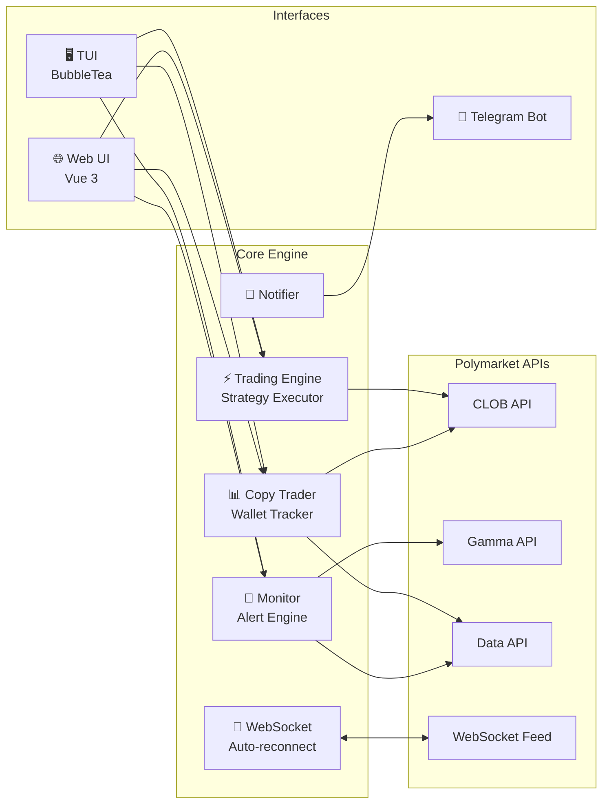

<div align="center">


# Orbitron

**Advanced algorithmic trading & portfolio management bot for Polymarket CTF Exchange**

[](https://golang.org/)
[](LICENSE)
[](https://goreportcard.com/report/github.com/atlasdev/orbitron)
[](https://github.com/atlas-is-coding/orbitron-polymarket-system/stargazers)
[](https://github.com/atlas-is-coding/orbitron-polymarket-system)
[](https://polygon.technology/)

[🌐 getorbitron.net](https://getorbitron.net) &nbsp;·&nbsp; [English](README.md) &nbsp;·&nbsp; [Русский](README_ru.md) &nbsp;·&nbsp; [中文](README_zh.md) &nbsp;·&nbsp; [한국어](README_ko.md) &nbsp;·&nbsp; [日本語](README_ja.md)

</div>

---

## Overview

Orbitron is a self-hosted, multi-interface bot for the **Polymarket CTF Exchange**. It combines a pluggable algorithmic trading engine with copy-trading, real-time market monitoring, and a secure multi-wallet architecture - all controllable from a terminal, browser, or Telegram chat.

> Trading and database features are **disabled by default** for safety. Enable only what you need in `config.toml`.

---

## Features

|  |  |  |
|:---:|:---:|:---:|
| **🖥 Terminal UI** | **🌐 Web UI** | **🤖 Telegram Bot** |
| BubbleTea TUI with tabbed layout - Markets, Trading, Copy Trading, Wallets, Strategies, Settings, Logs | Vue 3 SPA with real-time WebSocket updates, JWT authentication, and responsive dark theme | Full-featured bot mirror with inline keyboards and multi-step conversations |
| **⚡ 6 Trading Strategies** | **📊 Copy Trading** | **🔐 Secure Auth** |
| Arbitrage, Cross-Market, Fade Chaos, Market Making, Positive EV, Riskless Rate. Register your own in 3 lines | Monitor target wallets via Data API and auto-replicate their positions via CLOB API | L1 EIP-712 + L2 HMAC-SHA256. API keys derived in-memory at startup, never written to disk |
| **💼 Multi-Wallet** | **🔔 Alerts & Monitor** | **🌍 5 Languages** |
| Manage multiple active wallets. Toggle them on/off and view aggregated P&L from any interface | Real-time trade fills, position tracking, and price alerts - delivered instantly to Telegram | EN · RU · ZH · JA · KO with hot-reload - switch language without restarting |

---

## Architecture

Orbitron runs as seven independent, context-cancellable subsystems:



---

## Quick Start

### Option 1 - Setup Script (Recommended)

Works on Linux, macOS, and Windows (Git Bash / WSL). Installs Go & Node.js if missing, builds the frontend, and compiles the binary.

```bash
git clone https://github.com/atlas-is-coding/orbitron-polymarket-system.git
cd orbitron-polymarket-system
./setup.sh
```

### Option 2 - Manual Build

```bash
git clone https://github.com/atlas-is-coding/orbitron-polymarket-system.git
cd orbitron-polymarket-system

# Build the frontend (only needed if you modify Web UI sources)
cd internal/webui/web && npm install && npm run build && cd ../../..

# Run
go run ./cmd/bot/ --config config.toml
```

### Headless / Server Mode

```bash
go run ./cmd/bot/ --config config.toml --no-tui
```

> **No config.toml?** Run the bot without it - the TUI wizard launches automatically and walks you through a secure setup, including your private key configuration.

---

## Configuration

All behavior is controlled by `config.toml`. Copy `config.toml.example` as a starting point.

<details>
<summary><strong>Key configuration sections</strong></summary>

<br>

| Section | Key Fields | Notes |
|---|---|---|
| `[[wallets]]` | `private_key`, `api_key`, `api_secret`, `passphrase`, `chain_id` | `chain_id` `137` = Polygon Mainnet, `80002` = Amoy Testnet |
| `[trading]` | `enabled`, `max_position_usd`, `slippage_pct` | Disabled by default |
| `[trading.strategies.*]` | `enabled`, `execute_orders`, strategy params | Each strategy has its own subsection; all off by default |
| `[trading.risk]` | `stop_loss_pct`, `take_profit_pct`, `max_daily_loss_usd` | Applied globally across all active strategies |
| `[copytrading]` | `enabled`, `size_mode`, `traders` | `size_mode`: `proportional` or `fixed_pct` |
| `[monitor.trades]` | `enabled`, `poll_interval_ms` | Requires L2 auth |
| `[webui]` | `enabled`, `listen`, `jwt_secret` | `jwt_secret` doubles as the login password |
| `[telegram]` | `enabled`, `bot_token`, `admin_chat_id` | Single-admin model |
| `[database]` | `enabled`, `path` | SQLite; required for copy trading |
| `[ui]` | `language` | `en`, `ru`, `zh`, `ja`, `ko` - hot-reloads on change |
| `[proxy]` | `enabled`, `type`, `addr` | HTTP / SOCKS5 proxy support |

</details>

---

## Trading Strategies

All six strategies implement the `trading.Strategy` interface and run as independent goroutines inside the trading engine.

| Strategy | Description |
|---|---|
| **Arbitrage** | Detects price discrepancies across complementary YES/NO outcomes and captures the spread |
| **Cross-Market** | Finds correlated markets with divergent pricing and trades the divergence |
| **Fade Chaos** | Fades extreme price spikes, betting on mean reversion after irrational moves |
| **Market Making** | Places resting limit orders on both sides of the book to earn the bid-ask spread |
| **Positive EV** | Scans for markets where the implied probability appears significantly mispriced |
| **Riskless Rate** | Identifies near-resolved binary markets priced below the risk-free rate |

---

## Development

### Adding a Custom Strategy

```go
// 1. Implement the interface
type MyStrategy struct{}

func (s *MyStrategy) Name() string                    { return "my_strategy" }
func (s *MyStrategy) Start(ctx context.Context) error { /* trading logic */ return nil }
func (s *MyStrategy) Stop()                           { /* cleanup */ }

// 2. Register in cmd/bot/main.go
engine.Register(&MyStrategy{})
```

### Rebuilding the Web UI

The Vue 3 frontend is embedded into the Go binary at compile time. After modifying `internal/webui/web/src`:

```bash
cd internal/webui/web
npm install && npm run build
```

### Running Tests

```bash
# Unit tests
go test ./...

# Integration tests - requires a real Polymarket API key
POLY_PRIVATE_KEY=0xYOUR_KEY go test ./... -tags=integration -timeout 90s
```

---

## Troubleshooting

<details>
<summary><strong>Common issues</strong></summary>

<br>

| Issue | Cause & Solution |
|---|---|
| **401 Unauthorized** | Verify `private_key` is correct hex without `0x` prefix. L2 HMAC signatures expire in 30 s - sync your system clock (`timedatectl`, `w32tm`) |
| **Web UI shows "Network Error"** | A Go handler panicked before writing response headers. Check the terminal logs for the stack trace - there is no JSON body in this case |
| **Markets not loading in TUI / Web UI** | The internal EventBus buffer may be saturated at `trace` log level. Set `log.level = "info"` or `"debug"` in config |
| **WebSocket "Bad Handshake"** | The bot connects to specific channel paths (`.../ws/market`, `.../ws/user`), not the root URL. Check that your firewall allows outbound WebSocket connections to Polymarket |
| **Copy trading not working** | Requires `[database] enabled = true` and valid L2 credentials in `[[wallets]]` |

</details>

---

## License

[MIT](LICENSE) © 2025 Orbitron
