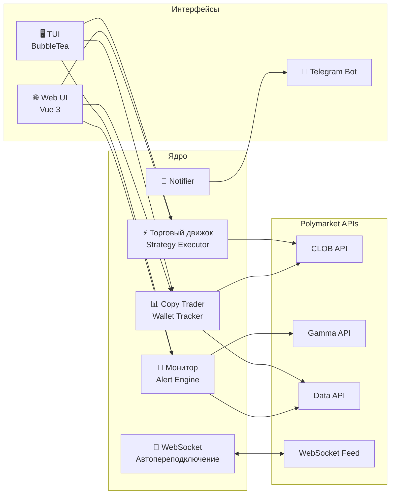

<div align="center">


# Orbitron

**Продвинутый бот алгоритмической торговли и управления портфелем на Polymarket CTF Exchange**

[](https://golang.org/)
[](LICENSE)
[](https://goreportcard.com/report/github.com/atlasdev/orbitron)
[](https://github.com/atlas-is-coding/orbitron-polymarket-system/stargazers)
[](https://github.com/atlas-is-coding/orbitron-polymarket-system)
[](https://polygon.technology/)

[🌐 getorbitron.net](https://getorbitron.net) &nbsp;·&nbsp; [English](README.md) &nbsp;·&nbsp; [Русский](README_ru.md) &nbsp;·&nbsp; [中文](README_zh.md) &nbsp;·&nbsp; [한국어](README_ko.md) &nbsp;·&nbsp; [日本語](README_ja.md)

</div>

---

## Обзор

Orbitron — это самохостируемый многоинтерфейсный бот для биржи **Polymarket CTF**. Он объединяет движок алгоритмической торговли с копитрейдингом, мониторингом рынка в реальном времени и безопасной мультикошельковой архитектурой — всем этим можно управлять из терминала, браузера или Telegram.

> Торговля и база данных **отключены по умолчанию** для безопасности. Включайте только нужное в `config.toml`.

---

## Функциональность

|  |  |  |
|:---:|:---:|:---:|
| **🖥 Terminal UI** | **🌐 Web UI** | **🤖 Telegram Bot** |
| TUI на BubbleTea с вкладками — Рынки, Торговля, Копитрейдинг, Кошельки, Стратегии, Настройки, Логи | Vue 3 SPA с обновлениями через WebSocket, JWT-аутентификацией и тёмной темой | Полнофункциональное зеркало TUI с inline-клавиатурами и пошаговыми диалогами |
| **⚡ 6 торговых стратегий** | **📊 Копитрейдинг** | **🔐 Безопасная авторизация** |
| Арбитраж, Кросс-маркет, Fade Chaos, Маркетмейкинг, Positive EV, Riskless Rate. Добавляйте свои за 3 строки | Мониторинг кошельков через Data API и автокопирование позиций через CLOB API | L1 EIP-712 + L2 HMAC-SHA256. API-ключи выводятся в памяти при старте, на диск не записываются |
| **💼 Мультикошелёк** | **🔔 Алерты и мониторинг** | **🌍 5 языков** |
| Несколько активных кошельков с переключением и агрегированным P&L из любого интерфейса | Исполнения ордеров, позиции и ценовые алерты в реальном времени — доставка в Telegram | EN · RU · ZH · JA · KO с горячей перезагрузкой — без перезапуска |

---

## Архитектура

Orbitron работает на семи независимых, прерываемых по контексту подсистемах:



---

## Быстрый старт

### Вариант 1 — Setup Script (рекомендуется)

Работает на Linux, macOS и Windows (Git Bash / WSL). Устанавливает Go и Node.js при необходимости, собирает фронтенд и компилирует бинарник.

```bash
git clone https://github.com/atlas-is-coding/orbitron-polymarket-system.git
cd orbitron-polymarket-system
./setup.sh
```

### Вариант 2 — Ручная сборка

```bash
git clone https://github.com/atlas-is-coding/orbitron-polymarket-system.git
cd orbitron-polymarket-system

# Сборка фронтенда (только при изменении исходников Web UI)
cd internal/webui/web && npm install && npm run build && cd ../../..

# Запуск
go run ./cmd/bot/ --config config.toml
```

### Headless / серверный режим

```bash
go run ./cmd/bot/ --config config.toml --no-tui
```

> **Нет config.toml?** Запустите бот без него — TUI-мастер запустится автоматически и проведёт через настройку, включая безопасную конфигурацию приватного ключа.

---

## Конфигурация

Всё поведение задаётся в `config.toml`. За основу возьмите `config.toml.example`.

<details>
<summary><strong>Ключевые секции конфигурации</strong></summary>

<br>

| Секция | Ключевые поля | Примечания |
|---|---|---|
| `[[wallets]]` | `private_key`, `api_key`, `api_secret`, `passphrase`, `chain_id` | `chain_id` `137` = Polygon Mainnet, `80002` = Amoy Testnet |
| `[trading]` | `enabled`, `max_position_usd`, `slippage_pct` | Отключено по умолчанию |
| `[trading.strategies.*]` | `enabled`, `execute_orders`, параметры стратегии | У каждой стратегии своя подсекция |
| `[trading.risk]` | `stop_loss_pct`, `take_profit_pct`, `max_daily_loss_usd` | Применяется ко всем активным стратегиям |
| `[copytrading]` | `enabled`, `size_mode`, `traders` | `size_mode`: `proportional` или `fixed_pct` |
| `[monitor.trades]` | `enabled`, `poll_interval_ms` | Требует L2 авторизацию |
| `[webui]` | `enabled`, `listen`, `jwt_secret` | `jwt_secret` — одновременно пароль для входа |
| `[telegram]` | `enabled`, `bot_token`, `admin_chat_id` | Один администратор |
| `[database]` | `enabled`, `path` | SQLite; обязателен для копитрейдинга |
| `[ui]` | `language` | `en`, `ru`, `zh`, `ja`, `ko` — горячая перезагрузка |
| `[proxy]` | `enabled`, `type`, `addr` | Поддержка HTTP / SOCKS5 прокси |

</details>

---

## Торговые стратегии

Все шесть стратегий реализуют интерфейс `trading.Strategy` и работают как независимые горутины внутри торгового движка.

| Стратегия | Описание |
|---|---|
| **Arbitrage** | Обнаруживает расхождения цен между взаимодополняющими исходами YES/NO и захватывает спред |
| **Cross-Market** | Находит коррелирующие рынки с расходящимися ценами и торгует дивергенцию |
| **Fade Chaos** | Торгует против экстремальных ценовых всплесков, ставя на возврат к среднему |
| **Market Making** | Выставляет лимитные ордера по обе стороны стакана для получения bid-ask спреда |
| **Positive EV** | Сканирует рынки с явно неверно оценёнными вероятностями |
| **Riskless Rate** | Выявляет бинарные рынки у разрешения, торгующиеся ниже безрисковой ставки |

---

## Разработка

### Добавление собственной стратегии

```go
// 1. Реализуйте интерфейс
type MyStrategy struct{}

func (s *MyStrategy) Name() string                    { return "my_strategy" }
func (s *MyStrategy) Start(ctx context.Context) error { /* логика торговли */ return nil }
func (s *MyStrategy) Stop()                           { /* очистка ресурсов */ }

// 2. Зарегистрируйте в cmd/bot/main.go
engine.Register(&MyStrategy{})
```

### Пересборка Web UI

Фронтенд на Vue 3 встраивается в Go-бинарник при компиляции. После изменений в `internal/webui/web/src`:

```bash
cd internal/webui/web
npm install && npm run build
```

### Запуск тестов

```bash
# Юнит-тесты
go test ./...

# Интеграционные тесты — требуют реальный API-ключ Polymarket
POLY_PRIVATE_KEY=0xYOUR_KEY go test ./... -tags=integration -timeout 90s
```

---

## Устранение неполадок

<details>
<summary><strong>Частые проблемы</strong></summary>

<br>

| Проблема | Причина и решение |
|---|---|
| **401 Unauthorized** | Проверьте `private_key` — hex без префикса `0x`. Подписи L2 HMAC живут 30 с — синхронизируйте системные часы |
| **Web UI показывает "Network Error"** | Go-хендлер запаниковал до отправки заголовков. Проверьте логи в терминале — JSON-тела в ответе не будет |
| **Рынки не загружаются в TUI / Web UI** | Буфер EventBus может быть переполнен при уровне `trace`. Установите `log.level = "info"` или `"debug"` |
| **WebSocket "Bad Handshake"** | Бот подключается к конкретным путям (`.../ws/market`, `.../ws/user`), а не к корневому URL. Проверьте файрвол |
| **Копитрейдинг не работает** | Требует `[database] enabled = true` и валидные L2-учётные данные в `[[wallets]]` |

</details>

---

## Лицензия

[MIT](LICENSE) © 2025 Orbitron
